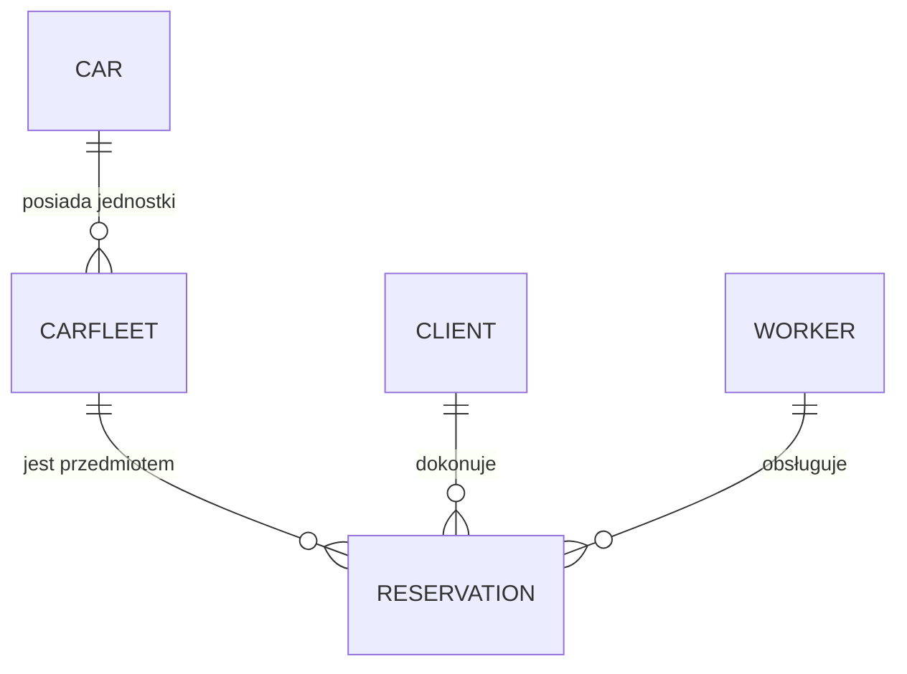

# 🚗 AutoExpert

AutoExpert to minimalistyczna aplikacja desktopowa stworzona w technologii **WPF** z użyciem **C#**, realizująca podstawowe funkcje wypożyczalni samochodów. Głównym celem projektu było stworzenie przyjemnego dla użytkownika interfejsu w architekturze **MVVM**, który poprawnie współpracuje z bazą danych **SQL Server** (przy wykorzystaniu **Entity Framework Core Code-First**). 

Aplikacja pozbawiona jest zbędnych funkcjonalności na rzecz dopracowania kluczowych mechanizmów, takich jak dynamiczne obliczanie kosztów wynajmu czy zabezpieczenie logiki biznesowej przed tzw. *overbookingiem*.

 

# Dla kogo jest aplikacja?
System został stworzony z myślą o dwóch głównych grupach docelowych:

* **Klienci:** Użytkownicy końcowi posiadający konto w systemie. Z poziomu swojego panelu mogą przeglądać kafelkowy katalog pojazdów (zdjęcia, cena, parametry), złożyć rezerwację w dostępnym terminie oraz wyświetlić historię swoich dotychczasowych wypożyczeń.
* **Administratorzy:** Użytkownicy z uprawnieniami do zarządzania systemem. Ich rola sprowadza się do obsługi zaplecza wypożyczalni: dodawania nowych pojazdów do bazy, monitorowania bieżącego statusu floty (dostępny / wypożyczony) oraz podglądu rezerwacji dokonanych przez klientów. 

# Interfejs aplikacji

---
 

# Wymagania funkcjonalne
* System musi umożliwiać rejestrację i logowanie.
* System musi pozwalać na przeglądanie floty samochodów z podziałem na parametry.
* Użytkownik musi mieć możliwość filtrowania samochodów w czasie rzeczywistym.
* Użytkownik musi mieć możliwość złożenia rezerwacji na wybrany samochód w przypadku braku wcześniejszego zarezerwowania w wybranym czasie.
* Klient musi posiadać dedykowaną zakładkę z podsumowaniem kosztów i historią jego poprzednich wypożyczeń.
* Pracownik musi mieć możliwość aktualizowania floty samochodów.
* Pracownik musi mieć możliwość ręcznego zarządzania rezerwacjami klientów.
* Użytkownik powinien mieć dostęp do kalendarza zawierającego obecne i przyszłe rezerwacje samochodu.
* Pracownik powinien mieć dostęp do wykresów i raportów finansowych danego samochodu.
* Użytkownik musi otrzymywać umowę najmu po zadeklarowaniu chęci rezerwacji samochodu.
* Pracownik powinien mieć możliwość modyfikacji parametrów samochodu.
* System musi spełniać zasady dostępności (motyw, wielkość czcionki itd.).
* Użytkownik musi mieć możliwość wyboru preferowanej waluty (np. PLN, EUR, USD) oraz formatu wyświetlania daty z poziomu ustawień aplikacji.
---
 

# Wymagania niefunkcjonalne
* Filtrowanie pojazdów powinno odbywać się natychmiastowo na załadowanej kolekcji w pamięci podręcznej.
* Hasła użytkowników powinny być zaszyfrowane zarówno w bazie danych jak i podczas przesyłu z niej.
* Interfejs musi być responsywny, unikać blokowania głównego wątku (UI Thread) i zapewniać czytelną architekturę informacji (Empty States, czytelne błędy).
* Baza danych musi zapewniać spójność relacyjną (klucze obce zapobiegające np. usunięciu klienta, który ma aktywne rezerwacje).
* Kod źródłowy musi przestrzegać separacji warstw we wzorcu MVVM (brak logiki biznesowej w plikach Code-Behind *.xaml.cs), co umożliwi łatwą rozbudowę systemu w przyszłości.
* W przypadku utraty połączenia z bazą danych (np. awaria serwera SQL), aplikacja nie może ulec nagłemu zamknięciu (tzw. crash), lecz musi wyświetlić użytkownikowi zrozumiały komunikat o problemach z siecią.
* Aplikacja musi elastycznie dostosowywać formaty wyświetlania danych (waluty, daty) w sposób spójny dla całego interfejsu, w oparciu o wybrane przez użytkownika standardy regionalne.
---
 

# Przypadki użycia

* ### Logowanie i autoryzacja ról  
**Opis:** Użytkownik wprowadza login i hasło w oknie startowym. Aplikacja weryfikuje poświadczenia, odpytując najpierw tabelę `Clients`, a następnie `Workers`. W zależności od tego, w której tabeli znajdzie dopasowanie, system zapisuje dane w odpowiedniej właściwości globalnej sesji i ładuje główny ekran programu. Obecność odpowiedniego obiektu w sesji determinuje, do jakich funkcji systemu (np. panel zarządzania lub widok klienta) użytkownik ma dostęp.

* ### Grupowe wyświetlanie dostępnej floty  
**Opis:** Po zalogowaniu klient widzi listę dostępnych modeli samochodów. Aby uniknąć dublowania wyników (np. wyświetlania trzech identycznych aut tego samego modelu na liście), system grupuje wyniki z bazy danych. 

* ### Złożenie nowej rezerwacji przez klienta  
**Opis:** Zalogowany klient wybiera pojazd z listy i w nowym oknie określa daty wynajmu (od-do). Następnie zachodzi walidacja poprawności dat i system dynamicznie przelicza całkowity koszt na podstawie stawki dobowej auta. Po zatwierdzeniu aplikacja zapisuje nowy rekord w tabeli, wiążąc numer VIN pojazdu z ID aktualnie zalogowanego klienta.

* ### Wyświetlanie filtrowanej historii wypożyczeń  
**Opis:** Użytkownik przechodzi do zakładki "Rezerwacje". System odczytuje identyfikator klienta z aktywnej sesji i odpytuje bazę danych wyłącznie o powiązane z nim rekordy. Baza zwraca przefiltrowaną listę. Jeżeli wynik zapytania jest pusty (klient nie ma historii), interfejs XAML wykrywa to i wyświetla stosowny komunikat tekstowy zamiast pustej tabeli.

---
 

# Roadmap
Plany na dalszy rozwój projektu:

- [ ] Implementacja pełnego panelu zarządzania dla Administratora (CRUD pojazdów).
- [ ] Dodanie możliwości edycji i anulowania rezerwacji przez klienta.
- [ ] System powiadomień/alertów o zbliżającym się terminie zwrotu pojazdu.
- [ ] Generowanie potwierdzenia rezerwacji do pliku PDF.

---
 

# Model danych
### Schemat bazy danych
  
System zarządza procesem wynajmu poprzez pięć powiązanych encji. Poniżej znajduje się szczegółowy opis klas modeli wraz z ich polami oraz uzasadnieniem biznesowym.

### 1. Cars (Model samochodu)
Encja definiuje stałe cechy danego modelu samochodu (katalog).
* **Kluczowe pola:** `IdCar` (PK), `Brand`, `Model`, `PricePerDay`, `ImagePath`, `SeatsCount`, `Segment`, `DoorsCount`, `GearboxType`, `FuelType`, `BodyType`, `TrunkCapacity`, `EngineCapacity`.
* **Uzasadnienie:** Przechowuje dane techniczne i wizualne (`ImagePath`), które są wspólne dla wielu egzemplarzy tego samego modelu. Pozwala to uniknąć redundancji danych w bazie.

### 2. CarFleets (Egzemplarz floty)
Reprezentuje konkretny, fizyczny pojazd dostępny w wypożyczalni.
* **Kluczowe pola:** `Vin` (PK), `RegistrationNumber`, `IsAvailable`, `Mileage`, `CarId` (FK).
* **Uzasadnienie:** Rozróżnienie między modelem (`Car`) a konkretnym autem pozwala śledzić indywidualny przebieg (`Mileage`) dla konkretnego samochodu (`VIN`) oraz status dostępności. Umożliwia to posiadanie wielu samochodów takiego samego modelu.

### 3. Clients (Klient)
Przechowuje dane osobowe i teleadresowe użytkowników - klientów - systemu.
* **Kluczowe pola:** `ClientID` (PK), `Username`, `Password`, `FirstName`, `LastName`, pełny adres (`Street`, `HouseNumber`, `ApartmentNumber`, `Country`, `City`, `PostalCode`), `Email`, `Phone`.
* **Uzasadnienie:** Niezbędna do autoryzacji użytkownika w systemie oraz generowania umów najmu i dokumentów kontaktowych.

### 4. Workers (Pracownik)
Encja opisująca personel obsługujący system.
* **Kluczowe pola:** `WorkerID` (PK), `Username`, `Password`, `FirstName`, `LastName`, `Position`.
* **Uzasadnienie:** Pozwala na identyfikację pracownika odpowiedzialnego za sfinalizowanie konkretnej rezerwacji.

### 5. Reservations (Rezerwacja)
Centralna encja wiążąca wszystkie pozostałe procesy.
* **Kluczowe pola:** `Id` (PK), `CarVin` (FK), `ClientId` (FK), `WorkerId` (FK), `StartDate`, `EndDate`, `TotalPrice`.
* **Uzasadnienie:** Rejestruje transakcję wynajmu. Łączy konkretny egzemplarz auta z klientem i pracownikiem, wyliczając koszt w oparciu o ramy czasowe.

 

# Relacje między encjami

Na podstawie implementacji klas `ICollection` oraz kluczy obcych (`ForeignKey`), w systemie występują następujące relacje:

* **Car → CarFleet (1:N):** Jeden model samochodu może posiadać wiele fizycznych egzemplarzy we flocie.
* **CarFleet → Reservation (1:N):** Konkretny pojazd (VIN) może mieć przypisanych wiele rezerwacji (historycznych i przyszłych).
* **Client → Reservation (1:N):** Jeden klient może dokonać wielu rezerwacji w systemie.
* **Worker → Reservation (1:N):** Pracownik może być przypisany jako opiekun/operator do wielu rezerwacji.

### Diagram ERD

---
 

# Architektura Systemu

Projekt został zrealizowany w architekturze klient-serwer bazy danych z wyraźnym rozdziałem warstw logicznych dzięki zastosowaniu wzorca projektowego MVVM.

Schemat warstwowy:
* **Warstwa Prezentacji (Frontend):** Zbudowana w technologii WPF. Odpowiada za interfejs użytkownika, szablony graficzne (XAML) oraz interakcję z operatorem (klientem/pracownikiem).
* **Warstwa Logiki Aplikacji (Backend Logic):** Zawarta w plikach ViewModels. Tutaj przetwarzane są dane, obsługiwane komendy (np. Logowanie, Rejestracja) oraz zachodzi komunikacja między widokiem a danymi.
* **Warstwa Dostępu do Danych (ORM):** Realizowana przez Entity Framework Core. Pełni rolę pośrednika mapowania obiektowo-relacyjnego, dzięki czemu operacje na bazie danych wykonywane są za pomocą kodu C#, a nie surowych zapytań SQL.
* **Warstwa Danych (Database):** Silnik Microsoft SQL Server. Przechowuje trwałe informacje o użytkownikach (pracownikach, klientach), flocie samochodowej oraz dokonanych rezerwacjach.

---
 

# Wykorzystane Technologie

* **C# (.NET 9)** - Główny język programowania wykorzystany do stworzenia logiki biznesowej.
* **WPF** - Framework do budowy interfejsów graficznych dla systemów Windows.
* **MS SQL Server** - Relacyjna baza danych przechowująca wszystkie informacje systemowe.
* **EF Core** - Narzędzie typu ORM automatyzujące komunikację z bazą danych.
* **Community Toolkit MVVM** - Biblioteka wspomagająca implementację wzorca MVVM.
* **GitHub** - System kontroli wersji umożliwiający pracę 4-osobowego zespołu nad jednym kodem.

---
 

# Uzasadnienie Wyboru

### Dlaczego WPF i C#?
Wybór padł na system .NET, ponieważ jest to standard rynkowy dla aplikacji desktopowych klasy Enterprise. WPF pozwala na tworzenie nowoczesnych, responsywnych interfejsów użytkownika, co zapewnia płynność działania panelu zarządzania flotą.

### Dlaczego Entity Framework Core?
Zastosowanie EF Core pozwoliło na podejście Code First. Zamiast ręcznie tworzyć tabele w SQL, zdefiniowaliśmy klasy w C# (Client, Car, Reservation), a system sam wygenerował bazę danych. Przyspieszyło to pracę zespołu i wyeliminowało błędy w niespójności typów danych.

### Dlaczego SQL Server?
Wybór SQL Server dostępnego przez localhost został podyktowany potrzebą pracy na pełnym, profesjonalnym silniku bazy danych. Takie rozwiązanie pozwoliło na łatwą migrację schematu bazy danych między członkami zespołu przy zachowaniu identycznej struktury u każdego z 4 członków grupy.

### Dlaczego CommunityToolkit.Mvvm?
Zdecydowaliśmy się na tę bibliotekę, aby zredukować ilość powtarzalnego kodu. Dzięki atrybutom takim jak `[ObservableProperty]` czy `[RelayCommand]`, kod jest bardziej czytelny, mniej podatny na błędy i łatwiejszy w utrzymaniu dla czterech programistów.

---
 
